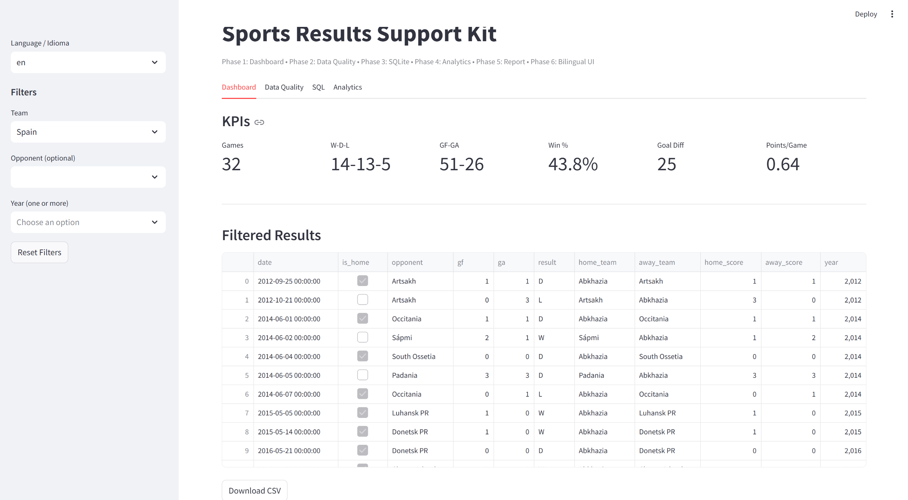
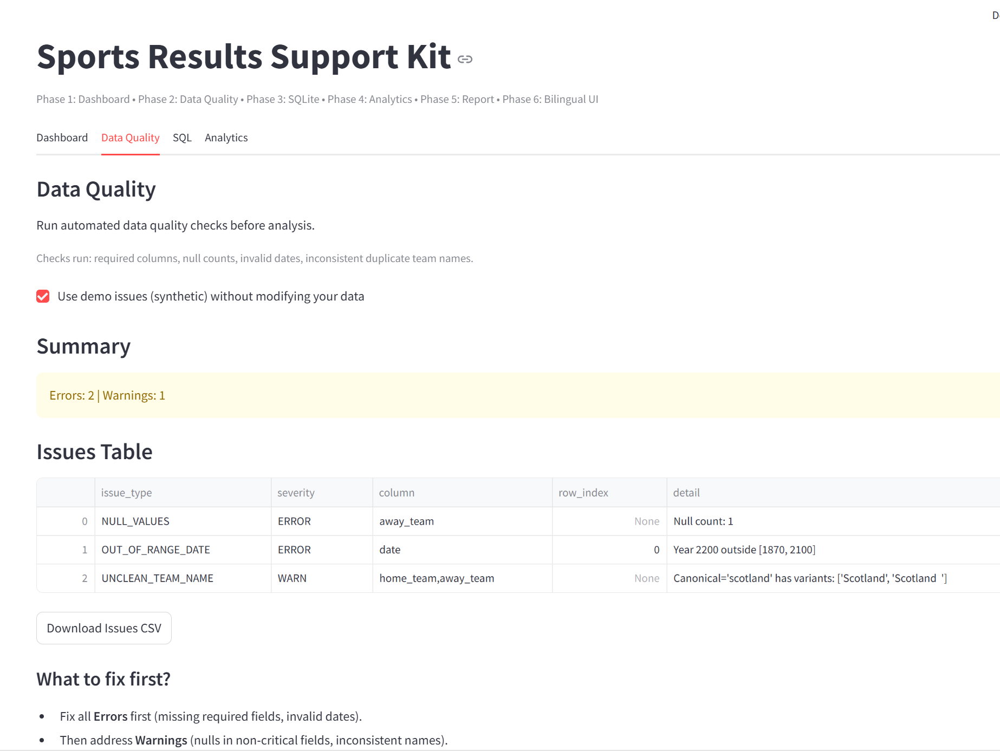
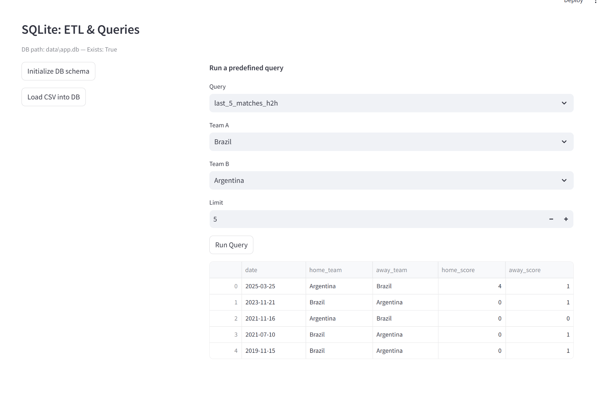
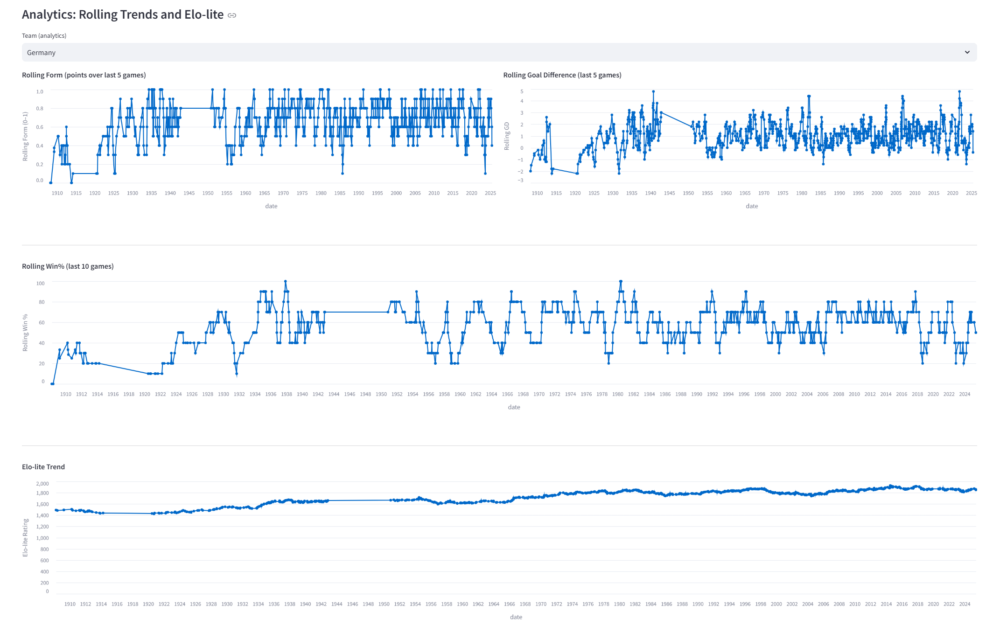

# Sports Results Support Kit

> Brand-agnostic Streamlit toolkit for sports results **analytics, QA, SQL, and one‑page reporting**.  
> **Bilingual UI (EN/ES)** · **SQLite backend** · **HTML report export** · **pytest + CI‑ready** · **Docker**

<p align="center">
  
</p>

---

## Demo (Screenshots)

- **Dashboard & KPIs**
  

- **Data Quality**
  

- **SQL (Predefined queries)**
  

- **Analytics (Rolling trends & Elo-lite)**
  

- **Sample Team Report (HTML)**
  <a href="outputs/report_team_Germany.html">Open sample one-page Team Report (Germany)</a>

> Tip: open the HTML report, then use your browser's **Print → Save as PDF** for a shareable PDF.

---

## Quickstart (3 commands)

```bash
pip install -r requirements.txt
python -m src.etl
streamlit run app/streamlit_app.py
```

Open the shown URL (e.g., http://localhost:8501).

### Minimal CSV schema
Your `data/results.csv` should include (camel-case not required):
- `date`, `home_team`, `away_team`, `home_score`, `away_score`
- (Optional) any extra columns are preserved and shown in tables.

---

## Why this project fits sports tech

- **Reusable & brand-agnostic**: Works with any football/soccer results CSV in a standard shape.
- **Lean, proven stack**: pandas + Streamlit + SQLite + Altair + pytest → easy to maintain and extend.
- **End-to-end**: Data Quality checks → SQL queries (5 ready-to-run) → Analytics (rolling form/GD/win%, Elo-lite) → One-page report.
- **Ops-ready**: CI workflow (flake8 + pytest), Dockerfile, and small runbooks for validation & troubleshooting.

---

## Features

- **Dashboard**: filters (Team, Opponent, Year), KPI cards (Games, W‑D‑L, GF‑GA, Win%), H2H table & form chart, CSV download.
- **Data Quality**: required columns, nulls, date range validity, duplicate/unclean team names, downloadable issues CSV.
- **SQLite backend**: `schema.sql`, ETL from CSV, and 5 parameterized queries wired to the UI.
- **Analytics**: Rolling form/GD/Win%, and a transparent **Elo‑lite** implementation with documented assumptions.
- **Reports**: One‑page **HTML** report for a team or H2H, with inline sparklines and KPI cards.
- **Bilingual UI**: English / Spanish via a centralized `src/i18n.py` layer.

---

## Run via Docker (optional)

```bash
docker build -t sports-kit:latest .
docker run --rm -p 8501:8501 -v "$PWD/data:/app/data" -v "$PWD/outputs:/app/outputs" sports-kit:latest
```

On Windows PowerShell, replace `$PWD` with the full path, e.g.:
```
-v "C:\path\to\repo\data:/app/data" -v "C:\path\to\repo\outputs:/app/outputs"
```

---

## Troubleshooting

- **Streamlit won’t start** → Ensure your virtualenv is active and deps installed: `pip install -r requirements.txt`. Try a different port: `--server.port 8502`.
- **CSV not found** → Place your file at `data/results.csv` (or run the project with the sample data provided).
- **SQLite “no such table”** → In the **SQL** tab, click **Initialize DB schema** then **Load CSV into DB**, or run `python -m src.etl`.
- **Empty charts** → Choose a team with more matches or clear restrictive filters.
- **Tests fail to import `src.*`** → Ensure `tests/conftest.py` adds the project root to `sys.path` and run `pytest` from the repo root.

---

## Development

- **Run tests**: `pytest -q`  
- **Lint**: `flake8 src app tests`  
- **CI**: GitHub Actions workflow at `.github/workflows/ci.yml` runs on every push.

---

## Español

### Resumen
Kit reutilizable y **agnóstico de marca** en Streamlit para resultados deportivos: filtros y KPIs, verificación de datos, consultas SQL (SQLite), analítica (tendencias móviles y Elo-lite) y exportación de **informe HTML** de una sola página. **Interfaz bilingüe (EN/ES)**.

### Inicio Rápido (3 comandos)
```bash
pip install -r requirements.txt
python -m src.etl
streamlit run app/streamlit_app.py
```

### ¿Por qué encaja en sports tech?
- **Reutilizable y ligero** (pandas, Streamlit, SQLite, Altair, pytest).
- **De extremo a extremo**: Calidad de Datos → SQL → Analítica → Reporte.
- **Listo para operaciones**: CI (lint + tests), Docker y runbooks.

### Solución de problemas
- CSV en `data/results.csv`.  
- Inicializa el esquema y carga el CSV en la pestaña **SQL** o ejecuta `python -m src.etl`.  
- Puerto ocupado → `--server.port 8502`.

---

## License
MIT — Free to use in portfolios, demos, and non‑commercial contexts. For production use, verify data licensing and attribution requirements.

